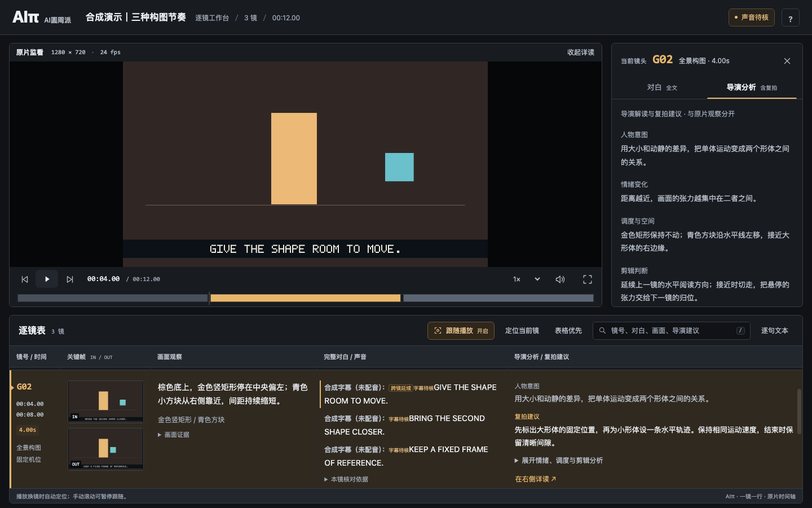

# AIπ｜AI圆周派 · 逐镜拉片与同步审片

把成片整理成一镜一行的镜头表，结合完整语言记录、导演解读和复拍建议，在同一个工作台对照原片阅读，再导出同步审片视频。



## 两个技能

| 技能 | 用途 |
| --- | --- |
| `aipi-film-study` · 逐镜拉片 | 测量真实帧时间、检测候选切点、抽取双帧、关联跨镜对白、生成镜头表和交互报告 |
| `aipi-sync-video` · 同步审片 | 按源帧数合成当前镜头说明、对白、导演分析与复拍建议，保留完整原声 |

工作台支持播放定位、自动跟随、手动滚动暂停跟随、全文搜索、关键帧放大、逐句文本和表格优先布局。导演解读与可见画面分开记录，跨镜句子完整显示。

自动检测生成候选，仍需要看片补切或合并。本项目不内置语音识别或字幕识别模型，识别与逐段核对使用宿主已有能力。`pending` 不代表没有对白，字幕核实也不等于音轨已经完整听审。

## 安装技能

在 [Releases 下载页](https://github.com/ai-pi-labs/aipi-film-tools/releases/latest)下载 `aipi-film-study.zip` 和 `aipi-sync-video.zip`。两个 ZIP 的根目录均为 `SKILL.md`，并附带源码、测试及 MIT 许可证。

在 WorkBuddy 中进入“技能 → 添加技能 → 上传技能”，分别导入并启用。安装目录由宿主管理。当前已验证 ZIP 格式和本机命令执行，WorkBuddy 客户端内的导入与调用仍需实际检查。[安装与依赖说明](docs/installation.md)

支持本地 `SKILL.md` 的其他代理宿主，可加载 `skills/` 下的对应目录。宿主仍需要能读取本地文件并执行所需运行工具。

## 调用示例

> 使用 AI圆周派 · 逐镜拉片（aipi-film-study）拉这条片子。一镜一行，核对完整对白、画外音、唱腔和片尾；每镜写画面观察、人物意图、情绪变化、调度、剪辑判断及复拍建议。生成播放联动报告、逐镜 CSV 和逐句 SRT。未确认内容保留待核，不用摘要替代原文。

> 使用 AI圆周派 · 同步审片（aipi-sync-video），用最终 study.json 和同一条原片导出同步视频。先执行生产检查；只有明确需要待核参考版时才使用 --reference。

## 本地运行

完整项目需要 **Node.js 22+、FFmpeg、ffprobe**；同步导出和网页回归还需要 **Chrome/Chromium** 与中文字体。没有 npm 运行依赖，不需要 `npm install`。仅使用拉片核心时 Node.js 18+ 即可；打包安装 ZIP 需要 Python 3。

先生成本项目的三镜合成示例：

```sh
npm run demo
```

打开生成的 `examples/demo/report.html`。示例素材由 FFmpeg 生成，不包含用户影片；演示文本明确保留示例和待核标记。

处理自己的原片：

```sh
node skills/aipi-film-study/scripts/engine.mjs probe input.mp4
node skills/aipi-film-study/scripts/engine.mjs detect input.mp4 --out work/study.json
node skills/aipi-film-study/scripts/engine.mjs frames work/study.json --video input.mp4 --out work/frames
# 在生成的 work/study.frames.json 中完成画面、语言及导演记录，再进行核对。
node skills/aipi-film-study/scripts/engine.mjs validate work/study.frames.json --production
node skills/aipi-film-study/scripts/report.mjs work/study.frames.json --out work/report.html
node skills/aipi-film-study/scripts/engine.mjs table work/study.frames.json --out work/shots.csv
node skills/aipi-film-study/scripts/engine.mjs subtitles work/study.frames.json --out work/dialogue.srt
node skills/aipi-sync-video/scripts/export.mjs work/study.frames.json --video input.mp4 --out work/review.mp4
```

生产检查失败时按具体原因补核；不要改标签伪装完成。需要查看尚未核完的数据时，在同步导出命令末尾添加 `--reference`，每张信息面板都会保留参考标记。

[数据格式](skills/aipi-film-study/references/study-format.md) · [语言核对与导演记录](skills/aipi-film-study/references/review-method.md) · [开发与验证](docs/development.md)

## 时间轴和输出边界

- 拉片引擎保留实测 PTS，支持可变帧率及非零起点抽帧；音频早于首视频帧的素材目前明确拒绝。
- 网页播放要求零起点；同步视频首版还要求实际验证过的恒定帧率。不能静默改速后套用旧切点。
- 同步视频按源时长播放，短镜可以暂停阅读。正文放不下时明确报错，可增加面板尺寸，不会静默截字。
- 可复制的音轨保留原包；其他编码可能转码。每轨起点、时长和音频参数都会检查。声音信号完整不代表转写已经穷尽。
- 本机完整回归基于 macOS。CI 验证 Linux 的核心命令和打包；Windows 及其他宿主需当地实测。

## 开源许可

Copyright © 2026 **AIπ（AI圆周派）**。应用代码、界面与工作流文档采用 [MIT License](LICENSE)。外部运行工具和用户素材各自保留其权利，见 [第三方说明](THIRD_PARTY_NOTICES.md)。
