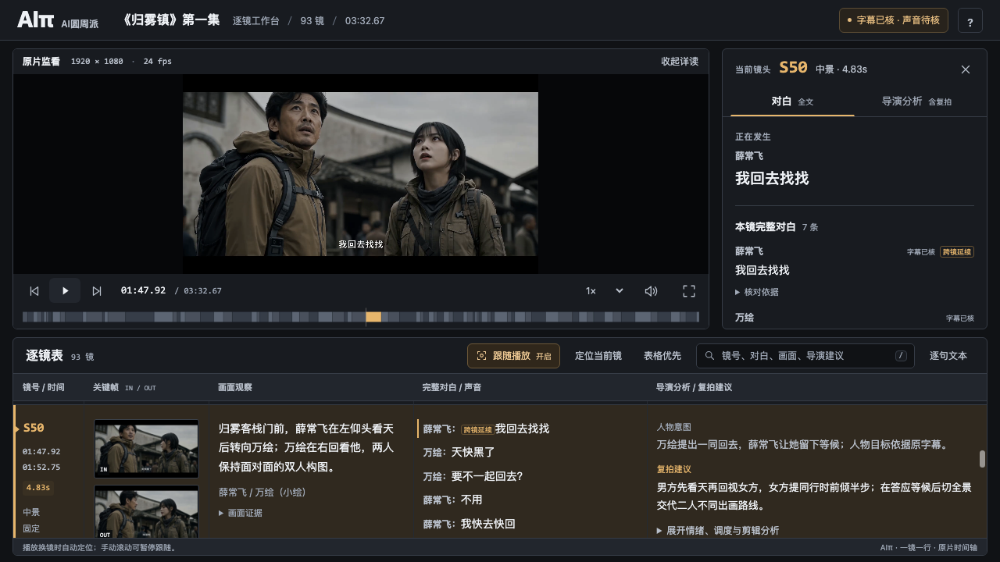

[简体中文](case-study.md) | English

# Guiwu Town (《归雾镇》), Episode 1 · Shot Study Package

This package contains a shot study of the approximately 3-minute-33-second episode: 93 shot-by-shot analyses, 74 timed text entries, 186 reference frames, an interactive viewing workbench, director's notes, reshooting suggestions, and a synchronized review video.

Video provided by 饭团鱼子酱（钱叔_）.

The report, analysis and subtitles are in Chinese. This guide explains how to use the package. File names below match the downloaded files.

[Download the package](https://github.com/ai-pi-labs/aipi-film-tools/releases/download/v1.0.1/aipi-guiwu-episode01-case.zip) · [Download the checksum file](https://github.com/ai-pi-labs/aipi-film-tools/releases/download/v1.0.1/aipi-guiwu-episode01-case.sha256)

## What's included

| File | Contents and use |
| --- | --- |
| `report.html` | Interactive workbench for comparing shots, dialogue, director's notes, and reshooting suggestions with the source video |
| `原片.mp4` | Source video of Guiwu Town, Episode 1 |
| `AIπ同步审片-参考版.mp4` | Reference review video showing the source footage and corresponding shot analysis together; play or pause to read |
| `逐镜导演分析.csv` | A 93-shot table with one shot per row, ready for filtering, annotations, and production reference |
| `完整逐句字幕.srt` | Subtitle file containing the 74 timed text entries for comparison with the video timeline |
| `study.json` | Structured shot-study data for adding analysis and continuing edits |
| `frames/` | 186 reference frames from the start and end of each shot, plus an image manifest |
| `工作台预览.png`, `同步视频预览.png` | Screenshots of the workbench and synchronized review video |
| `CASE-README.md`, `verification.json`, `SHA256SUMS` | Package notes, check records, and file checksums |

## Shot-by-shot workbench



The workbench keeps one shot per row. Each row shows its time range, duration, reference frames, visual observations, dialogue, director's notes, and reshooting suggestions. The notes cover character intent, emotional changes, eyelines and space, and reasons for cuts, connecting what appears on screen with the creative choices behind it.

- **Follow playback:** The current shot is highlighted as the video plays, and the table scrolls to the corresponding row.
- **Jump to a shot:** Click a shot to seek to its position in the source video and revisit a detail.
- **Find details:** Search by shot number, dialogue, or director's notes. Enlarge reference frames for a closer look.
- **Read at your own pace:** Scrolling manually suspends automatic following so you can read longer dialogue and analysis. Sentences spanning a cut appear in full in each relevant shot.

## Synchronized review video


The source video plays above the corresponding visual observations, dialogue, director's notes, and reshooting suggestions. The review video preserves the original aspect ratio, audio, and pace. Pause when a shot has more text to read. Use it for focused viewing, group discussion, or reshooting preparation.

## How to open the package

1. Download and fully extract `aipi-guiwu-episode01-case.zip`.
2. Open the `aipi-guiwu-episode01-case/` folder, then open `report.html` to use the workbench.
3. Open `AIπ同步审片-参考版.mp4` in a video player, or open the CSV in a spreadsheet application to read the shot records.

Keep the folder structure intact so the workbench can load the source video and reference frames. You do not need to install the skills to view these files.

If your browser cannot play the local video directly, run this command from the extracted folder:

```sh
python3 -m http.server 8000
```

Then open `http://127.0.0.1:8000/report.html`.

To check the download, run the following command from the folder containing both the ZIP and its `.sha256` file:

```sh
shasum -a 256 -c aipi-guiwu-episode01-case.sha256
```

## Using the study

Study individual shots in the workbench, add production annotations in the CSV, or use the synchronized video for a viewing discussion. Develop a shooting plan from the director's notes and reshooting suggestions.

Dialogue and sung passages still contain items to confirm. Check them against the source video before finalizing a script. Specific flags are recorded in the workbench and accompanying files.

[Material usage notes](../THIRD_PARTY_NOTICES.md) · [Installation guide](installation.md) · [Tool workflow](usage.md) · [Repository home](../README.md)
